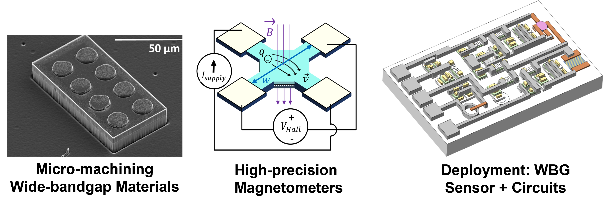

I am a new assistant professor at [TU Delft](https://www.tudelft.nl/en/) in the school of [Electrical Engineering, Math, and Computer Science](https://www.tudelft.nl/en/eemcs), in the [Microelectronics Department](http://microelectronics.tudelft.nl/). I am embedded in the [Electronics Instrumentation Laboratory](https://ei.et.tudelft.nl/), with a focus on integrating wide-bandgap materials for high precision and harsh environment applications with ICs to enable novel microsystems with pratical implementations. I have a particular focus on magnetic field sensors that outpace silicon Hall-effect sensors and survive harsher conditions.  If your research interests overlap, send me an email!

Key Topics of Interest
=========
* Gallium Nitride, Silicon Carbide, Gallium Oxide, Diamond  
* Hall Effect Sensors  
* Power Semiconductor Devices  
* Microelectromechanical Systems (MEMS)  
* Microfabrication  
* CMOS Compatibility  

About Me
======
I grew up in Ann Arbor, Michigan, USA, which is home to the University of Michigan. Desiring nicer weather and ocean-front living, I got my BS degree in electrical engineering at the [California Institute of Technology](https://www.caltech.edu/) in 2013. I then moved up to the San Francisco Bay Area and obtained my MS and PhD in electrical engineering from [Stanford University](https://www.stanford.edu/) in 2015 and 2019, respectively. My thesis focused on creating high quality magnetometers for extreme environments using gallium nitride, as well as some micromachining techniques in silicon carbide, both wide-bandgap semiconductors. I then was a postdoc at [Lawrence Livermore National Laboratory (LLNL)](https://www.llnl.gov/), where I gained perspective on RF opto-electronic power devices known as photo-conductive semiconductor switches. I am now at TU Delft as an assistant professor as of August 2022, where I am excited to combine my love of sensors for harsh environments with optically coupled conduction mechanisms to open new avenues for high-performing microsystems, from fundamental research to device development and (someday) deployment.

Site Credit
------
This site was created using [AcademicPages](https://academicpages.github.io). Source code is available at [this repo](https://github.com/karendowling/karendowling.github.io). Many thanks to R. Krishnapriyan for assistance in getting this page started. 
